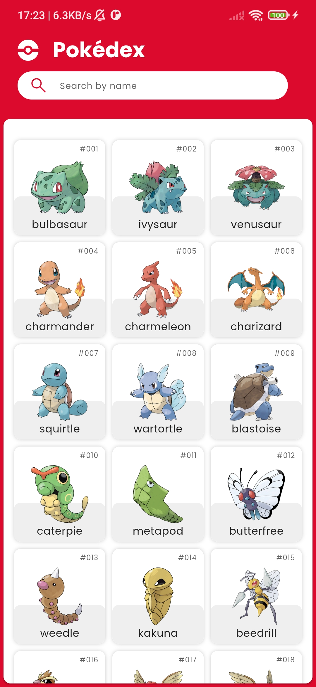
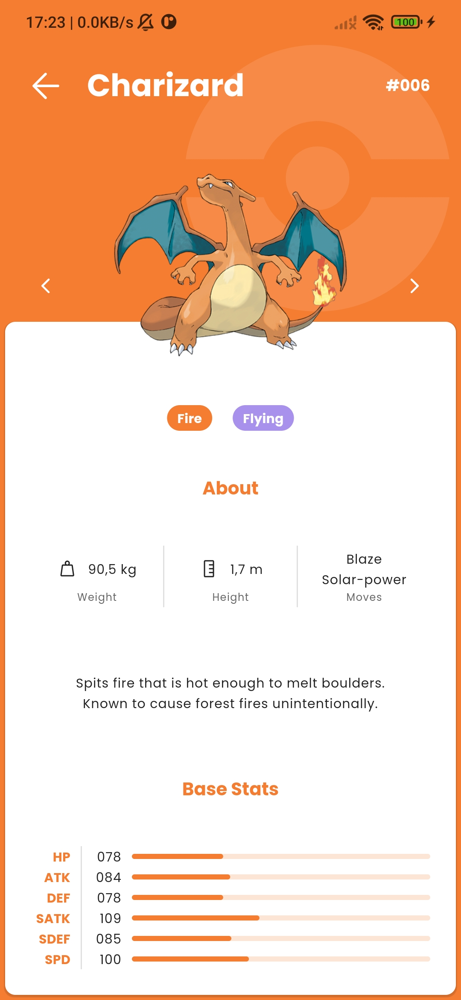

# Flutter Pokédex

> Recomendável executar em um ambiente Android.

Aplicação para exibir os dados dos Pokémons existentes.

## Estilização

Baseado no [Figma](https://www.figma.com/community/file/979132880663340794) feito por [Ricardo Schiniegoski](https://www.figma.com/@ricardohs).

## API

Utilização da [PokeAPI](https://pokeapi.co/) para busca dos dados do Pokémons.

URL Base: `https://pokeapi.co/api/v2/`

Com esta API, é possível listar os pokémons, fazer buscas por nome, número ou tipagem, listar as habilidades e muito mais funcionalidades relacionadas
à esse mundo Pokémon.

## Requisitos

- [x] Estrutura do Projeto (Clean Architecture);
- [x] Gerenciamento de Estado (MobX);
- [x] Injeção de Dependência (get_it);
- [x] Consumo da API;
- [x] Testes Unitários;
- [x] Criação de Channels.

#### Bônus - Opcional

- [x] Busca de pokémons usando MobX;
- [ ] Animações avançadas para melhorar a experiência do usuário;
- [ ] Testes de widget para verificar a renderização correta da interface do usuário.

## Como executar

Primeiramente, é necessário ter o [flutter](https://docs.flutter.dev/get-started/install) instalado e configurado na sua máquina.

Após instalar o flutter, é necessário instalar as dependências listadas no [pubspec.yaml](pubspec.yaml). Para isso, utilizamos a linha de comando:

```shell
flutter clean && flutter pub get && dart run build_runner build --delete-conflicting-outputs
```

Dessa forma conseguimos iniciar o app de uma forma limpa e sem possíveis problemas.

Agora, para executar a aplicação no android, utilize a seguinte linha de comando:

```shell
flutter run
```

Pronto! Sua Pokédex já está rodando em seu dispositivo Android

## Funcionalidades

Na tela principal, podemos visualizar a listagem dos pokémons existentes.

<p>
  
</p>

Aqui também podemos buscar os pokémons pelos respectivos nomes (apenas uma parte contida no nome retorna os pokémons).

<p>
  
</p>

Cada pokémon tem sua página de detalhes contendo seu nome, número da pokédex, imagem, altura, peso, habilidades, descrição e os status base.

<p>
  
</p>

Aqui é possível navegar para o pokémon anterior e seguinte, caso existam.

#### Android Channel

Dentro da tela de detalhes, há uma funcionalidade que utiliza da API de sensor de movimento nativa do Android.

Quando balançar o dispositivo, será emitido o som do pokémon (jogos), tendo uma interação sonora com cada um deles.

## Testes

Para rodar os testes, é necessário utilizar a seguinte linha de comando:

```shell
flutter clean && flutter pub get && dart run build_runner build --delete-conflicting-outputs && flutter test --no-pub --coverage lib
```

- [x] Todas as camadas
  - [x] Data
  - [x] Domain
  - [x] Presentation

## License

Este projeto está licenciado sob a [MIT License](https://opensource.org/license/mit/). Sinta-se à vontade para usar, modificar e distribuir o código de acordo com os termos da licença.

Ao adicionar a Licença MIT ao rodapé, você está concedendo aos usuários a liberdade de usar, modificar e distribuir seu código, ao mesmo tempo em que lhes oferece proteções legais. Se houver algo mais que você gostaria de incluir ou modificar, por favor, me avise!
